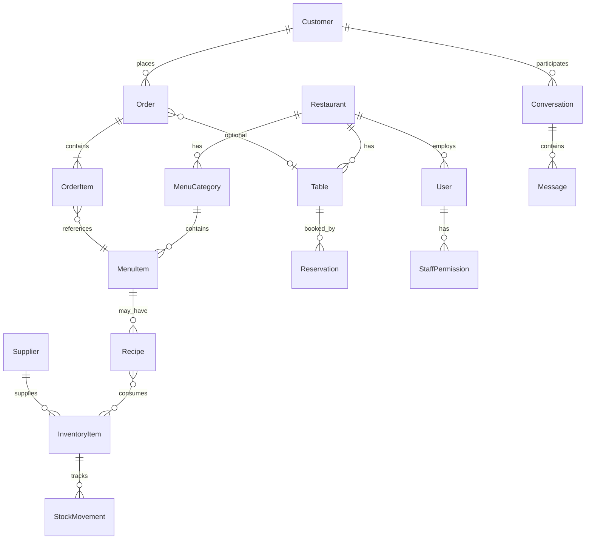

# RestaurantOS — Frontend Architecture Analysis

**Purpose:** Document the current React frontend before implementing a **FastAPI** backend with **PostgreSQL (Supabase)**, **Firebase Authentication**, and **Firebase Cloud Messaging (FCM)**.

**Repository:** `restaurant-management-system` (Vite + React 18 + TypeScript)  
**Analysis date:** 2026-05-31  
**Backend status:** None — all persistence is in-memory singleton services or `localStorage`.

---

## Executive Summary

RestaurantOS is a **single-page application (SPA)** that prototypes a full restaurant operations platform: public ordering site, staff/admin dashboard, POS, kitchen display, inventory, reservations, conversations, accounting, and a customer portal. The UI is production-quality in layout and flows, but **data is almost entirely client-side mock state**. Three domains (orders, menu admin, inventory) use well-typed singleton services with pub/sub; most other modules embed local `useState` mock arrays.

The frontend is **ready for API integration** via `VITE_API_BASE_URL` and Supabase env placeholders, but **no `fetch` calls to a real API exist today** except unused `mock/api.ts` scaffolding.

---

## 1. Application Structure

### 1.1 Technology Stack

| Layer | Technology |
|--------|------------|
| Build | Vite 5, TypeScript 5 |
| UI | React 18, React Router 6 |
| Styling | Tailwind CSS 3 |
| Components | Headless UI, Lucide icons |
| Charts | Recharts |
| Dates | date-fns |

### 1.2 Directory Layout

```
resturantmanagement/
├── index.html
├── package.json
├── vite.config.ts
├── .env.example
└── src/
    ├── main.tsx                 # App bootstrap
    ├── App.tsx                  # Routes + auth guards
    ├── index.css
    ├── config/
    │   └── app.ts               # Env-driven app config (API URL, tax, Supabase placeholders)
    ├── contexts/
    │   └── AuthContext.tsx      # Active auth (localStorage + demo users)
    ├── constants/
    │   └── currency.ts          # formatCurrency()
    ├── types/
    │   ├── index.ts             # User, Table, Reservation, Customer, DashboardStats
    │   ├── order.ts
    │   ├── menu.ts
    │   └── inventory.ts         # Richest domain model
    ├── data/
    │   ├── mockData.ts          # Dashboard stats, sample orders
    │   └── menu.ts              # Public-site menu + cart types (simpler than admin menu)
    ├── services/                # In-memory singletons (future API adapters)
    │   ├── orderService.ts
    │   ├── menuService.ts
    │   ├── inventoryService.ts
    │   └── authService.ts       # Legacy; superseded by AuthContext
    ├── hooks/
    │   ├── useOrders.ts
    │   ├── useMenu.ts
    │   ├── useInventory.ts
    │   └── useAuth.ts
    ├── mock/
    │   └── api.ts               # mockGet/Post/Put/Delete — barely used
    ├── utils/
    │   ├── cart.ts              # Public cart localStorage
    │   ├── orderUtils.ts
    │   └── dateUtils.ts
    ├── components/
    │   ├── Layout/              # MainLayout, Sidebar, Header
    │   ├── Dashboard/
    │   ├── Orders/
    │   ├── Menu/
    │   ├── Inventory/
    │   ├── Alerts/
    │   └── AI/
    └── pages/
        ├── Dashboard.tsx, Orders.tsx, Menu.tsx, Inventory.tsx, ...
        ├── Auth/Login.tsx, Signup.tsx
        ├── Public/Home.tsx, Menu.tsx, Checkout.tsx, Reservations.tsx
        ├── Customer/CustomerDashboard.tsx
        └── Conversations/Conversations.tsx
```

### 1.3 Architectural Patterns

| Pattern | Where used |
|---------|------------|
| **Singleton services** | `OrderService`, `MenuService`, `InventoryService` — in-memory DB + listener subscriptions |
| **React Context** | `AuthProvider` — session in `localStorage` |
| **Custom hooks** | `useOrders`, `useMenu`, `useInventory` — bridge UI ↔ services |
| **Page-local state** | POS, Kitchen, Staff, Tables, Reports, Accounting, Conversations, most admin lists |
| **Dual data sources** | Public menu (`data/menu.ts`) vs admin menu (`MenuService` / `types/menu.ts`) — not unified |

### 1.4 Configuration (`src/config/app.ts`)

| Variable | Purpose |
|----------|---------|
| `VITE_API_BASE_URL` | Intended backend (default `http://localhost:3000`) — **unused for HTTP** |
| `VITE_ENABLE_MOCK_DATA` | Gates `mock/api.ts` |
| `VITE_TAX_RATE`, `VITE_SERVICE_CHARGE` | Checkout/POS pricing (NGN-oriented defaults) |
| `VITE_SUPABASE_URL`, `VITE_SUPABASE_ANON_KEY` | Placeholders for future DB client |
| `VITE_WHATSAPP_NUMBER` | Public CTA deep link |

---

## 2. Frontend Routes

Defined in `src/App.tsx` with `BrowserRouter`.

### 2.1 Route Map

| Path | Guard | Component | Purpose |
|------|--------|-----------|---------|
| `/` | None (redirect if logged in) | `Home` | Marketing + featured items |
| `/menu` | None | `PublicMenu` | Browse & cart |
| `/order/checkout` | None | `Checkout` | Guest checkout |
| `/reservations` | None | `PublicReservations` | Book a table |
| `/auth/login` | None | `Login` | Sign in |
| `/auth/signup` | None | `Signup` | Register (customer role) |
| `/dashboard` | `ProtectedRoute` | `Dashboard` (index) | Admin KPIs |
| `/dashboard/orders` | Protected | `Orders` | Order management |
| `/dashboard/conversations` | Protected | `Conversations` | Omnichannel inbox |
| `/dashboard/menu` | Protected | `Menu` | Menu CRUD |
| `/dashboard/inventory` | Protected | `Inventory` | Stock CRUD |
| `/dashboard/reservations` | Protected | `Reservations` | Admin reservations |
| `/dashboard/staff` | Protected | `Staff` | Staff list |
| `/dashboard/staff/permissions` | Protected | `StaffPermissions` | Module ACL toggles |
| `/dashboard/tables` | Protected | `Tables` | Table CRUD + QR placeholder |
| `/dashboard/customers` | Protected | `Customers` | CRM / loyalty |
| `/dashboard/reports` | Protected | `Reports` | Analytics charts |
| `/dashboard/accounting` | Protected | `Accounting` | Ledger-style UI |
| `/dashboard/settings` | Protected | `Settings` | Restaurant + integrations |
| `/dashboard/kitchen` | Protected | `KitchenDisplay` | KDS |
| `/dashboard/pos` | Protected | `POS` | Point of sale |
| `/customer/dashboard` | `CustomerRoute` | `CustomerDashboard` | Customer portal |
| `*` | None | `NotFound` | 404 |

**Layout:** Protected dashboard routes nest under `MainLayout` (`<Outlet />` + Sidebar + Header + `AIAssistantWidget`).

### 2.2 Auth Guards

**`ProtectedRoute`** (staff dashboard):

- Requires authenticated user.
- Allows roles: `admin`, `manager`, `kitchen` only.
- Others → redirect to `/customer/dashboard`.

**`CustomerRoute`:**

- Requires any authenticated user (no role filter).

**Root redirect (`/`):**

- If logged in: `admin`/`manager`/`kitchen` → `/dashboard`; `customer` → `/customer/dashboard`.

**Gaps:**

- `Login` / `Signup` always `navigate('/dashboard')` on success — customers should go to `/customer/dashboard`.
- Type includes `waiter` but guard does not allow waiter into dashboard.
- `kitchen` can access full sidebar (not kitchen-only).

---

## 3. Dashboard Modules

Navigation: `src/components/Layout/Sidebar.tsx`.

### 3.1 Main Menu

| Module | Route | Data source | Maturity |
|--------|-------|-------------|----------|
| Dashboard | `/dashboard` | `mockDashboardStats`, `RecentOrders`, `SmartAlerts` | UI complete, static mocks |
| Orders | `/dashboard/orders` | `OrderService` + `useOrders` | **Best wired** — CRUD, kanban, filters |
| Conversations | `/dashboard/conversations` | Local state | WhatsApp/IG/website inbox mock |
| Menu Management | `/dashboard/menu` | `MenuService` + hooks | **Full CRUD** — categories, modifiers |
| Inventory | `/dashboard/inventory` | `InventoryService` + hooks | **Full CRUD** — movements, alerts |
| Reservations | `/dashboard/reservations` | Local mock array | List/search only |
| Tables | `/dashboard/tables` | Local state | Create/delete, QR button noop |
| Staff | `/dashboard/staff` | Local mock | List UI |
| Staff Permissions | `/dashboard/staff/permissions` | Local mock | `pos`, `conversations`, `kitchen`, `inventory`, `reports` |
| Customers | `/dashboard/customers` | Local mock | Loyalty tiers |
| Reports | `/dashboard/reports` | Static chart data | Recharts bar chart |
| Accounting | `/dashboard/accounting` | Static transactions | ERP-style snapshot |
| Settings | `/dashboard/settings` | Local state | Tabs: general, ops, notifications, Firebase/Twilio fields |

### 3.2 Quick Access

| Module | Route | Notes |
|--------|-------|-------|
| Kitchen Display | `/dashboard/kitchen` | Separate status model (`new`/`preparing`/`ready`/`completed`) |
| POS | `/dashboard/pos` | Own menu array; hold orders; payment modal — **not synced with OrderService** |

### 3.3 Global Widgets

- **`AIAssistantWidget`** — keyword-matched canned responses (orders, peak hours, stock, kitchen).
- **`SmartAlerts`** — static alert cards (low stock, peak hours, kitchen delay, WhatsApp pending).
- **`Header`** — search placeholder, notifications badge (mock).

---

## 4. Public Website Modules

| Module | Route | Features |
|--------|-------|----------|
| Home | `/` | Hero, categories, testimonials, add-to-cart, WhatsApp link, auth CTAs |
| Menu | `/menu` | Category filter, cart in `localStorage` (`restaurantos-cart`) |
| Checkout | `/order/checkout` | Order type (dine-in/takeaway/delivery), payment method, tax + service charge; **fake order ID** (`WEB-xxxx`) |
| Reservations | `/reservations` | Form → local success state only |

**Cart utilities:** `src/utils/cart.ts` — load/save/add/update/remove; no server sync.

**Public menu data:** `src/data/menu.ts` — 6 items, simpler schema than admin `MenuItem`.

---

## 5. Authentication Flows

### 5.1 Current Implementation (`AuthContext`)

| Step | Behavior |
|------|----------|
| Session storage | `localStorage` key `restaurantos-auth` (user JSON, no password) |
| Registered users | `restaurantos-users` — email → `{ password, profile }` (**plaintext passwords**) |
| Demo accounts | Hardcoded: `admin@gmail.com` / `admin1234` (admin), `staff@gmail.com` / `staff1234` (manager), `user@gmail.com` / `user1234` (customer) |
| Login | 800ms delay; validate demo or registered user |
| Signup | Always creates `role: 'customer'` |
| Logout | Clears session key |

### 5.2 Roles (`User.role`)

`admin` | `manager` | `waiter` | `kitchen` | `customer`

Only `admin`, `manager`, `kitchen` enter staff dashboard per route guard. **`waiter` is typed but blocked from dashboard.**

### 5.3 Target Flow (Firebase Auth + FastAPI)

Recommended split:

```
┌─────────────┐     ID Token      ┌──────────────┐     JWT verify      ┌─────────────┐
│   React     │ ───────────────►  │ Firebase Auth │ ◄────────────────  │  FastAPI    │
│   (Vite)    │                   └──────────────┘                    │  + Supabase │
└─────────────┘                                                     └─────────────┘
       │                                                                      │
       │  Authorization: Bearer <firebase_id_token>                         │
       └──────────────────────────────────────────────────────────────────────┘
```

| Concern | Owner |
|---------|--------|
| Sign up / sign in / password reset | Firebase Auth |
| Custom claims or role | Firebase custom claims **or** `users` row in Postgres synced on first login |
| Business authorization | FastAPI dependency: verify token + load `user_id`, `restaurant_id`, `role`, permissions |
| Staff permissions matrix | Postgres `staff_permissions` (UI already models module flags) |

### 5.4 Legacy Code

`src/services/authService.ts` uses key `restaurant-user` and `mockUser` — **not used by `App.tsx`**. Remove or merge during backend integration.

---

## 6. Restaurant Workflows

### 6.1 Order Lifecycle (Admin — `OrderService`)

**Statuses:** `pending` → `confirmed` → `preparing` → `ready` → `served` → `completed` | `cancelled`

**Side effects (in service):**

- `confirmed` → set `confirmedAt`, auto-assign waiter name (random mock).
- `preparing` → assign chef (random mock).
- `ready` → `readyAt`, compute `actualPrepTime`.
- `completed` → `completedAt`, auto `paymentStatus: paid` if pending.

**Order types:** `dine-in` | `takeaway` | `delivery`  
**Payment:** `pending` | `paid` | `refunded` | `failed`  
**Line items:** modifiers, per-item kitchen status.

**UI:** Orders page — grid/list/kanban, create modal, filters, stats.

### 6.2 Public Online Order Flow

```
Browse menu → localStorage cart → Checkout form → setTimeout fake submit → clear cart → show WEB-{id}
```

**Not connected** to `OrderService` or kitchen queue.

### 6.3 POS Flow

```
Select category → add to cart → optional hold → payment (cash/card/digital) → local state only
```

Uses embedded menu, table number, order type (`dine-in` | `carryout` | `delivery`). **No persistence to orders API.**

### 6.4 Kitchen Display Flow

Separate model: `new` | `preparing` | `ready` | `completed`, print ticket via `window.open`. **Not linked to admin order statuses.**

### 6.5 Reservation Flow

| Channel | Flow |
|---------|------|
| Public | Form submit → UI confirmation (no API) |
| Admin | List/search mock reservations; status: confirmed/seated/completed/cancelled/no-show |

Types in `types/index.ts` include `tableId` + nested `Table`; admin page uses `tableNumber` only.

### 6.6 Inventory Workflow

```
Item CRUD → stock movements (purchase/usage/waste/adjustment/transfer/return)
         → auto alerts (low/out/expiring/expired)
         → optional purchase orders & recipes (typed, partial UI)
```

### 6.7 Conversations / Omnichannel

Mock threads from `whatsapp` | `instagram` | `website`, bot replies, link to `activeOrder`. Implies future webhooks from Meta/WhatsApp Business API.

### 6.8 Customer Portal

Tabs: orders, favorites, addresses, loyalty, profile — all mock. Expect APIs scoped to `customer_id` from Firebase UID.

### 6.9 Accounting / Reports

Display-only aggregates; no double-entry engine in frontend. Backend should expose ledger entries, AP/AR, and reporting aggregates.

---

## 7. Data Entities Implied by the UI

### 7.1 Core Entities

| Entity | Key fields (from types/UI) |
|--------|----------------------------|
| **User** | id, name, email, role, avatar, phone, isActive, createdAt |
| **Restaurant / Settings** | name, email, phone, address, timezone, currency, operating hours, taxRate, serviceCharge |
| **MenuCategory** | id, name, description, displayOrder, isActive, image |
| **MenuItem** | id, categoryId, name, description, price, cost, profitMargin, availability flags, prep time, ingredients, allergens, dietaryTags, modifiers, variants, nutritionalInfo |
| **Order** | orderNumber, tableNumber, customer fields, items[], status, priority, totals, payment, orderType, staff assignments, timestamps |
| **OrderItem** | menuItemId, quantity, unitPrice, modifiers, specialInstructions, item status |
| **Table** | number, capacity, status, location, shape |
| **Reservation** | customer contact, tableId/number, date, time, partySize, status, specialRequests |
| **Customer** | contact, loyaltyPoints, totalOrders, totalSpent, tier, dietaryRestrictions, addresses |
| **Staff** | profile + role (waiter/kitchen/…) + hours + rating |
| **StaffPermission** | userId + module flags (pos, kitchen, inventory, …) |
| **InventoryItem** | sku, stock levels, supplier, location, perishable, expiration |
| **StockMovement** | type, quantity, reason, reference, performedBy |
| **Supplier** | contact, payment terms, rating |
| **PurchaseOrder** | supplier, line items, status, delivery dates |
| **InventoryAlert** | type, severity, isRead |
| **Recipe** | menuItemId, ingredients[], costs |
| **Conversation** | customer, source channel, last message, unread |
| **Message** | conversationId, sender (customer/bot/staff), content |
| **Transaction / LedgerEntry** | description, amount, type income/expense, date |
| **Notification** | user/device targeting for FCM |
| **FCM DeviceToken** | userId, token, platform |

### 7.2 Entity Relationship (Conceptual)



### 7.3 Duplication / Normalization Notes

- Unify **public `MenuItem`** (`data/menu.ts`) with **admin `MenuItem`** (`types/menu.ts`) — single API, optional “public” DTO.
- Align **kitchen KDS statuses** with **order/order_item statuses**.
- `types/index.ts` `InventoryItem` is simpler than `types/inventory.ts` — use one schema in DB.

---

## 8. Required API Endpoints

Suggested **REST** surface under `VITE_API_BASE_URL` (e.g. `/api/v1`). All protected routes: `Authorization: Bearer <firebase_id_token>` unless noted.

### 8.1 Auth & Users

| Method | Endpoint | Description |
|--------|----------|-------------|
| POST | `/auth/session` | Exchange Firebase token; upsert user profile; return app user + permissions |
| GET | `/users/me` | Current profile |
| PATCH | `/users/me` | Update profile |
| GET | `/users` | List staff (admin/manager) |
| POST | `/users` | Invite/create staff |
| PATCH | `/users/{id}` | Update staff |
| GET | `/users/{id}/permissions` | Staff module permissions |
| PUT | `/users/{id}/permissions` | Replace permissions |

### 8.2 Restaurant Settings

| Method | Endpoint | Description |
|--------|----------|-------------|
| GET | `/settings` | Restaurant config |
| PATCH | `/settings` | Update settings |
| GET | `/settings/operating-hours` | |
| PUT | `/settings/integrations` | Firebase/Twilio config (server-side secrets only) |

### 8.3 Menu

| Method | Endpoint | Description |
|--------|----------|-------------|
| GET | `/menu/categories` | List categories |
| POST | `/menu/categories` | Create |
| PATCH | `/menu/categories/{id}` | Update |
| DELETE | `/menu/categories/{id}` | Delete if empty |
| PUT | `/menu/categories/reorder` | displayOrder |
| GET | `/menu/items` | Filter: category, available, search |
| GET | `/menu/items/{id}` | Detail |
| POST | `/menu/items` | Create |
| PATCH | `/menu/items/{id}` | Update |
| DELETE | `/menu/items/{id}` | Delete |
| PATCH | `/menu/items/bulk-availability` | |
| GET | `/public/menu` | **Public** — active items only (no auth) |

### 8.4 Orders

| Method | Endpoint | Description |
|--------|----------|-------------|
| GET | `/orders` | Filters: status, type, date, table, search |
| GET | `/orders/stats` | Dashboard + orders page stats |
| GET | `/orders/{id}` | Detail |
| POST | `/orders` | Create (POS, admin, public checkout) |
| PATCH | `/orders/{id}` | General update |
| PATCH | `/orders/{id}/status` | Status transition + timestamps |
| PATCH | `/orders/{id}/items/{itemId}/status` | Kitchen line status |
| POST | `/orders/{id}/cancel` | Cancel with reason |
| GET | `/orders/kitchen` | KDS-optimized queue |
| POST | `/orders/public` | **Optional** guest checkout (rate-limited) |

### 8.5 Tables & Reservations

| Method | Endpoint | Description |
|--------|----------|-------------|
| GET | `/tables` | |
| POST | `/tables` | |
| PATCH | `/tables/{id}` | |
| DELETE | `/tables/{id}` | |
| GET | `/tables/{id}/qr` | QR payload or image URL |
| GET | `/reservations` | Admin list |
| POST | `/reservations` | Create (admin + public) |
| PATCH | `/reservations/{id}` | Status updates |
| DELETE | `/reservations/{id}` | |
| GET | `/reservations/availability` | Public slots by date/party size |

### 8.6 Inventory

| Method | Endpoint | Description |
|--------|----------|-------------|
| GET | `/inventory/items` | |
| POST | `/inventory/items` | |
| PATCH | `/inventory/items/{id}` | |
| DELETE | `/inventory/items/{id}` | |
| GET | `/inventory/categories` | |
| POST | `/inventory/categories` | |
| GET | `/inventory/suppliers` | |
| POST | `/inventory/suppliers` | |
| GET | `/inventory/movements` | |
| POST | `/inventory/movements` | Record movement |
| GET | `/inventory/alerts` | |
| PATCH | `/inventory/alerts/{id}/read` | |
| GET | `/inventory/stats` | |
| GET/POST | `/inventory/purchase-orders` | |
| GET/PUT | `/recipes/{menuItemId}` | |

### 8.7 Customers & Loyalty

| Method | Endpoint | Description |
|--------|----------|-------------|
| GET | `/customers` | Admin CRM |
| POST | `/customers` | |
| GET | `/customers/{id}` | |
| PATCH | `/customers/{id}` | |
| GET | `/customers/me/orders` | Customer portal |
| GET | `/customers/me/favorites` | |
| POST | `/customers/me/favorites` | |
| GET | `/customers/me/addresses` | |
| CRUD | `/customers/me/addresses/{id}` | |
| GET | `/customers/me/loyalty` | Points + tier |

### 8.8 Conversations

| Method | Endpoint | Description |
|--------|----------|-------------|
| GET | `/conversations` | Inbox |
| GET | `/conversations/{id}/messages` | |
| POST | `/conversations/{id}/messages` | Staff reply |
| POST | `/webhooks/whatsapp` | Inbound (server) |
| POST | `/webhooks/instagram` | Inbound (server) |

### 8.9 Reports & Accounting

| Method | Endpoint | Description |
|--------|----------|-------------|
| GET | `/dashboard/stats` | Today KPIs |
| GET | `/reports/revenue` | Time series |
| GET | `/reports/orders` | |
| GET | `/accounting/transactions` | |
| POST | `/accounting/ledger-entries` | |
| GET | `/accounting/summary` | Cash flow, AP, AR |

### 8.10 Notifications (FCM)

| Method | Endpoint | Description |
|--------|----------|-------------|
| POST | `/notifications/devices` | Register FCM token |
| DELETE | `/notifications/devices/{token}` | Unregister |
| POST | `/notifications/send` | Admin test / system (internal) |

### 8.11 Real-Time (Recommended)

| Channel | Use case |
|---------|----------|
| WebSocket `/ws/orders` or Supabase Realtime | Order/kitchen updates |
| WebSocket `/ws/conversations` | New messages |
| FCM push | Background alerts (new order, low stock, reservation) |

---

## 9. Required Database Tables (PostgreSQL / Supabase)

Multi-tenant note: add `restaurant_id` (UUID) on all business tables if SaaS; below assumes single-tenant or tenant column on each.

### 9.1 Auth & Access

```sql
-- Firebase UID as primary external identity
users (
  id UUID PK,
  firebase_uid TEXT UNIQUE NOT NULL,
  email TEXT UNIQUE NOT NULL,
  name TEXT,
  phone TEXT,
  role TEXT NOT NULL, -- admin, manager, waiter, kitchen, customer
  avatar_url TEXT,
  is_active BOOLEAN DEFAULT true,
  restaurant_id UUID FK,
  created_at TIMESTAMPTZ,
  updated_at TIMESTAMPTZ
);

staff_permissions (
  id UUID PK,
  user_id UUID FK users,
  module TEXT NOT NULL, -- pos, kitchen, inventory, conversations, reports, settings, accounting
  granted BOOLEAN DEFAULT false,
  UNIQUE(user_id, module)
);

fcm_device_tokens (
  id UUID PK,
  user_id UUID FK,
  token TEXT UNIQUE NOT NULL,
  platform TEXT, -- web, ios, android
  created_at TIMESTAMPTZ
);
```

### 9.2 Restaurant Configuration

```sql
restaurants (
  id UUID PK,
  name TEXT,
  email TEXT,
  phone TEXT,
  address TEXT,
  timezone TEXT,
  currency_code TEXT,
  tax_rate NUMERIC,
  service_charge_rate NUMERIC,
  whatsapp_number TEXT,
  created_at TIMESTAMPTZ
);

operating_hours (
  id UUID PK,
  restaurant_id UUID FK,
  day_of_week SMALLINT,
  open_time TIME,
  close_time TIME,
  is_closed BOOLEAN
);

integration_settings (
  restaurant_id UUID PK FK,
  firebase_project_id TEXT,
  twilio_account_sid TEXT,
  -- secrets in vault / env, not plain columns in production
  updated_at TIMESTAMPTZ
);
```

### 9.3 Menu

```sql
menu_categories (...);
menu_items (...);
menu_modifiers (...);
menu_modifier_options (...);
menu_item_modifiers (menu_item_id, modifier_id);
menu_variants (...);
-- optional: nutritional_info JSONB on menu_items
```

### 9.4 Orders

```sql
orders (
  id UUID PK,
  order_number TEXT UNIQUE,
  restaurant_id UUID FK,
  customer_id UUID FK NULL,
  table_id UUID FK NULL,
  customer_name TEXT,
  customer_phone TEXT,
  customer_email TEXT,
  status TEXT,
  priority TEXT,
  order_type TEXT,
  subtotal NUMERIC,
  tax_amount NUMERIC,
  discount_amount NUMERIC,
  total_amount NUMERIC,
  payment_status TEXT,
  payment_method TEXT,
  notes TEXT,
  estimated_prep_time INT,
  actual_prep_time INT,
  assigned_waiter_id UUID FK NULL,
  assigned_chef_id UUID FK NULL,
  created_at, updated_at, confirmed_at, ready_at, served_at, completed_at
);

order_items (
  id UUID PK,
  order_id UUID FK,
  menu_item_id UUID FK,
  quantity INT,
  unit_price NUMERIC,
  total_price NUMERIC,
  special_instructions TEXT,
  status TEXT
);

order_item_modifiers (
  order_item_id UUID FK,
  modifier_id UUID FK,
  name TEXT,
  price NUMERIC
);
```

### 9.5 Floor Plan

```sql
tables (
  id UUID PK,
  restaurant_id UUID FK,
  number INT,
  capacity INT,
  status TEXT,
  location TEXT,
  shape TEXT,
  qr_code_url TEXT
);

reservations (
  id UUID PK,
  restaurant_id UUID FK,
  table_id UUID FK NULL,
  customer_id UUID FK NULL,
  customer_name TEXT,
  customer_phone TEXT,
  customer_email TEXT,
  reservation_date DATE,
  reservation_time TIME,
  party_size INT,
  status TEXT,
  special_requests TEXT,
  created_at TIMESTAMPTZ
);
```

### 9.6 Customers

```sql
customers (
  id UUID PK,
  user_id UUID FK NULL, -- link when registered
  name TEXT,
  email TEXT,
  phone TEXT,
  loyalty_points INT DEFAULT 0,
  loyalty_tier TEXT,
  total_orders INT,
  total_spent NUMERIC,
  dietary_restrictions JSONB,
  created_at TIMESTAMPTZ
);

customer_addresses (...);
customer_favorites (customer_id, menu_item_id);
```

### 9.7 Inventory

```sql
inventory_categories (...);
suppliers (...);
inventory_items (...);
stock_movements (...);
inventory_alerts (...);
purchase_orders (...);
purchase_order_items (...);
recipes (...);
recipe_ingredients (...);
```

### 9.8 Conversations

```sql
conversations (
  id UUID PK,
  customer_id UUID FK NULL,
  source TEXT, -- whatsapp, instagram, website
  external_thread_id TEXT,
  last_message_at TIMESTAMPTZ,
  unread BOOLEAN,
  status TEXT
);

messages (
  id UUID PK,
  conversation_id UUID FK,
  sender_type TEXT, -- customer, staff, bot
  sender_id UUID NULL,
  content TEXT,
  created_at TIMESTAMPTZ
);
```

### 9.9 Finance

```sql
ledger_entries (
  id UUID PK,
  restaurant_id UUID FK,
  description TEXT,
  amount NUMERIC,
  entry_type TEXT, -- income, expense
  category TEXT,
  reference_type TEXT, -- order, purchase_order, manual
  reference_id UUID,
  occurred_at TIMESTAMPTZ
);
```

### 9.10 Supabase Considerations

- Enable **Row Level Security (RLS)** per `restaurant_id` and role.
- Use **Supabase Realtime** on `orders`, `order_items`, `inventory_alerts`, `messages`.
- Store files (menu images, QR) in **Supabase Storage** with signed URLs.
- Firebase Auth JWT validated in FastAPI; map `sub` → `users.firebase_uid`.

---

## 10. Missing Backend Requirements

### 10.1 Critical Gaps

| Gap | Impact |
|-----|--------|
| **No backend package** | Zero Python/FastAPI code in repo |
| **No HTTP client layer** | Services are in-memory; `apiBaseUrl` unused |
| **No Firebase SDK** | Auth is fake localStorage |
| **No FCM** | Settings UI mentions Firebase server key; no device registration or push |
| **Split order pipelines** | Public checkout, POS, and `OrderService` are three isolated paths |
| **Split menu catalogs** | Public vs admin menu will diverge in production |
| **Password security** | Plaintext in `localStorage` for registered users |
| **No payment gateway** | Checkout/POS simulate payment only |
| **No file upload API** | Menu images are external URLs only |
| **No multi-restaurant tenancy** | Single implicit restaurant in config |

### 10.2 FastAPI Backend — Recommended Modules

```
app/
├── main.py
├── core/           # config, security (Firebase verify)
├── db/             # SQLAlchemy + Supabase connection
├── api/v1/
│   ├── auth.py
│   ├── menu.py
│   ├── orders.py
│   ├── inventory.py
│   ├── reservations.py
│   ├── customers.py
│   ├── conversations.py
│   ├── reports.py
│   ├── accounting.py
│   └── notifications.py
├── services/       # business logic (status transitions, stock deduction)
├── models/         # SQLAlchemy ORM
├── schemas/        # Pydantic DTOs mirroring src/types/*
└── workers/        # FCM send, webhook processors
```

### 10.3 Firebase Authentication Checklist

- [ ] Firebase project + Web app config in frontend env
- [ ] Replace `AuthContext` login/signup with Firebase Auth SDK
- [ ] Send ID token on every API request
- [ ] FastAPI middleware: verify token with Firebase Admin SDK
- [ ] On first login: `POST /auth/session` creates `users` row and default role
- [ ] Role assignment: admin invite flow; signup → `customer` only
- [ ] Fix post-login redirect by role

### 10.4 Firebase FCM Checklist

- [ ] Web push / service worker for dashboard alerts
- [ ] `POST /notifications/devices` after login
- [ ] Server-side send on: new order, order ready, low stock, reservation reminder, new WhatsApp message
- [ ] Store **FCM server key / service account** only on backend (Settings UI must not persist secrets in browser)
- [ ] Topic-based: `restaurant_{id}_kitchen`, `restaurant_{id}_managers`

### 10.5 Integration Points Referenced in UI

| Integration | UI location | Backend need |
|-------------|-------------|--------------|
| Firebase | Settings → integrations | Admin SDK + FCM |
| Twilio | Settings → integrations | SMS for reservation confirmations |
| WhatsApp | Home link, SmartAlerts, Conversations | Business API webhooks |
| Instagram | Conversations | Meta Graph API webhooks |
| Supabase | `.env.example` | Postgres + optional Realtime/Storage |

### 10.6 Business Rules to Implement Server-Side

1. **Order status state machine** — valid transitions; idempotent updates.
2. **Tax/service charge** — from `restaurants` settings, not hardcoded 10% in `OrderService`.
3. **Inventory deduction** — on order completion via recipes (`recipe_ingredients`).
4. **Reservation conflict detection** — table capacity + time overlap.
5. **Order number generation** — atomic sequence per restaurant/day.
6. **Permissions enforcement** — mirror `StaffPermissions` + Settings roles tab.
7. **Audit log** — who changed order status, stock adjustments, ledger entries.

### 10.7 Frontend Refactor Before/During API Integration

| Priority | Task |
|----------|------|
| P0 | Add `apiClient.ts` (fetch + auth header + error handling) |
| P0 | Replace singleton services with API calls (keep interfaces) |
| P0 | Firebase Auth in `AuthContext` |
| P1 | Unify menu source for public + admin |
| P1 | Wire POS + Checkout + KDS to `POST /orders` and WebSocket |
| P1 | Role-based login redirect and sidebar filtering |
| P2 | Remove `authService.ts` duplicate |
| P2 | Connect `mockGet('/dashboard/stats')` pattern or delete mock layer |

---

## Appendix A: Demo Credentials (Current Frontend)

| Email | Password | Role |
|-------|----------|------|
| admin@gmail.com | admin1234 | admin |
| staff@gmail.com | staff1234 | manager |
| user@gmail.com | user1234 | customer |

---

## Appendix B: Order Status Mapping (Unification Task)

| Admin `OrderService` | Kitchen KDS | Suggested canonical |
|---------------------|-------------|---------------------|
| pending | new | pending |
| confirmed | — | confirmed |
| preparing | preparing | preparing |
| ready | ready | ready |
| served | — | served |
| completed | completed | completed |
| cancelled | — | cancelled |

Align **order_item.status** with KDS line-level updates.

---

## Appendix C: Environment Variables (Full Stack)

**Frontend (existing):** see `.env.example`

**Backend (to add):**

```
DATABASE_URL=postgresql://...
SUPABASE_URL=
SUPABASE_SERVICE_ROLE_KEY=
FIREBASE_PROJECT_ID=
GOOGLE_APPLICATION_CREDENTIALS=...
FCM_ENABLED=true
CORS_ORIGINS=http://localhost:5173,https://restos.quanttechnologiesltd.cloud
```

---

*This document reflects the repository as analyzed. No application source files were modified except the addition of this file.*
